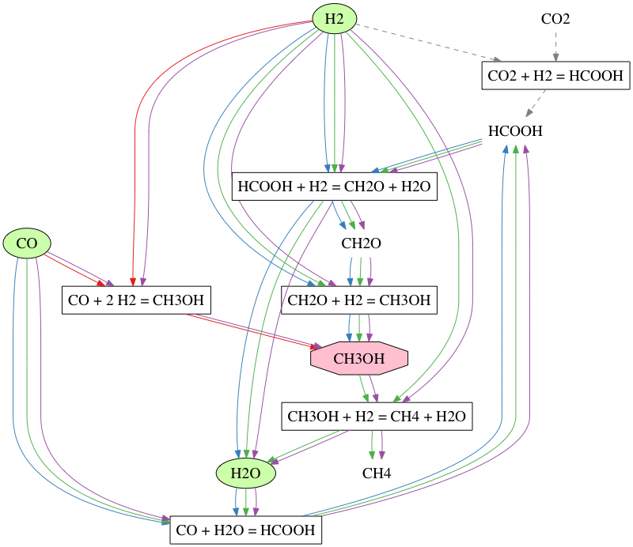

# GraphChem

GraphChem finds all possible synthesis pathways for a product given takes a set of reactions and a set of initial reactants.

## Running

GraphChem requires Python 3 and the [networkx] package. Once networkx is installed, the following will run the demo below:

    git clone git@github.com:justinnhli/graphchem.git
    cd graphchem
    python3 graphchem.py

## Example

Using the following reactions:

    CO2 + H2 = HCOOH
    CO + H2O = HCOOH
    HCOOH + H2 = CH2O + H2O
    CH2O + H2 = CH3OH
    CH3OH + H2 = CH4 + H2O
    CO + 2 H2 = CH3OH

If we start with initial (umlimited) amounts of carbon monoxide (CO), hydrogen gas (H2), and water (H20), and try to synthesize methanol (CH3OH), GraphChem will find a total of two synthesis pathways:

    2 synthesis networks found:

    network 1:
        CO + 2 H2 = CH3OH

    network 2:
        CO + H2O = HCOOH
        CH2O + H2 = CH3OH
        HCOOH + H2 = CH2O + H2O

Additionally, GraphChem can generate a [GraphViz] reaction network visualization:

[GraphViz]: https://www.graphviz.org/
[networkx]: https://networkx.github.io/
